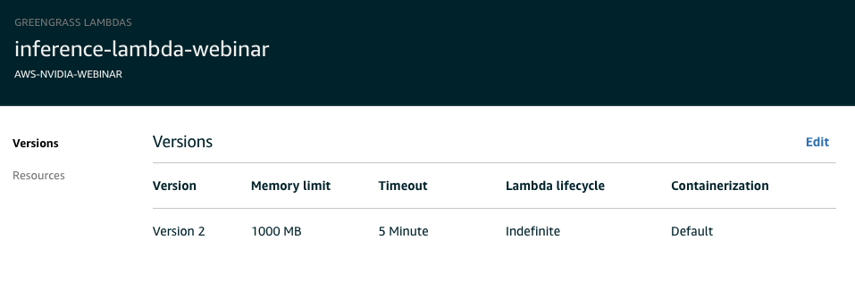
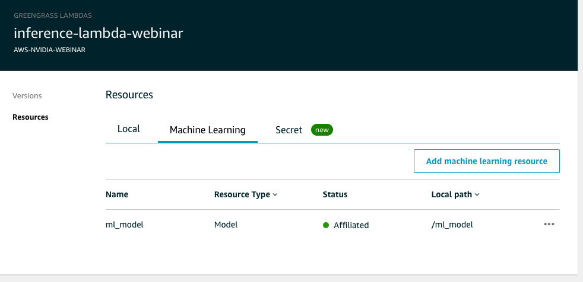
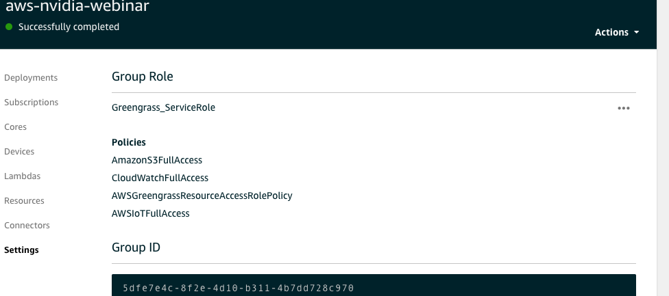
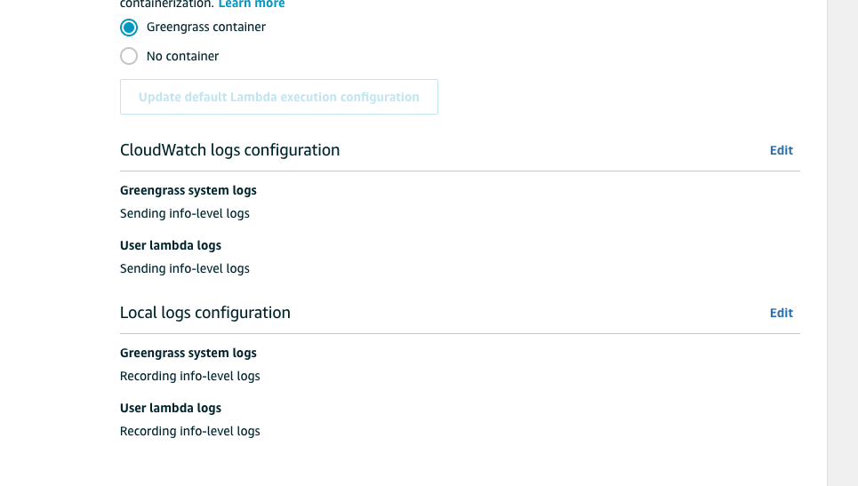
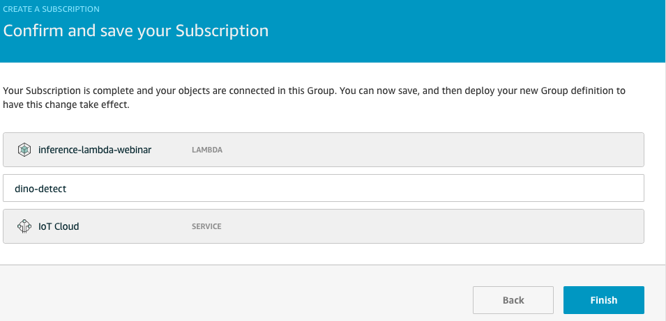

# AWS ML@Edge with NVIDIA Jetson Nano

Goal of this workshop is to demostrate how to deploy AWS SageMaker trained image classification model on to Nvidia Jetson Nano using AWS IoT Greengrass.
Deployed edge application (IoT Greengrass lambda) on the Nano will detect different types of Lego Dinosaurs. Here is a sample image.


This repo is short and updated version of https://github.com/mahendrabairagi/AWS_ML_At_Edge_With_NVIDIA_Jetson_Nano.

Here are the steps we will follow:

### Step 1: Download AWS SageMaker trained model
### Step 2: Deploy model on Jetson Nano using AWS IoT Greengrass
### Step 3: Visualize and analyze video analytics from the model inference on Jetson Nano

Let's start with Step 1:

### Step 1: Download trained model
In this lab we will use Amazon SageMaker trained model. Model is trained using steps in https://github.com/mahendrabairagi/AWS_ML_At_Edge_With_NVIDIA_Jetson_Nano . Model detects different types of Lego Dinosaurs images.  Model is already converted using SageMaker Neo for Jetson Nano platform.

Download model from : [link](https://mahendra-ml-models.s3.amazonaws.com/model.tar.gz)

**** Upload the model to your own S3 bucket *****. This will be used in step 2.4 below.

### Step 2: Deploy model on Jetson Nano using AWS IoT Greengrass
This step will need
- 2.1 Installing SageMaker Neo runtime
- 2.2 Installing AWS IoT Greengrass 
- 2.3 Setup and configure Inference code using AWS Lambda
- 2.4 Set machine learning at edge deployment
- 2.5 Deploy machine learning at edge on NVIDIA Jetson Nano
- 2.6 Run model, check inference

#### 2.1 Installing SageMaker Neo runtime
SageMaker Neo Runtime aka SageMaker Neo DLR is a runtime library that helps run models compiled using SageMaker Neo in the cloud. In our model training step, last step is to compile model using SageMaker Neo. In following steps we will install SageMaker Neo Runtime.
- Go to SageMaker Neo git https://neo-ai-dlr.readthedocs.io/en/latest/install.html
- Check step under "Installing Pre-built DLR Wheels for Your Device"
- You can install SageMaker Neo using  "sudo pip install  'link-to-matching-wheel-on-S3'"
- link-to-matching-wheel-on-S3 is for Jetson Nano, look for link such as
https://public-ryan.s3.amazonaws.com/jetson/nano/neo-prebuilt.tgz
- Download this file, unzip the .whl file
- log into Jetbot dekstop or SSH to jetbot.  Install this .whl file using command such as 
```
sudo pip install dlr****-*****.whl
```

- also install AWS Python SDK boto3, this is needed for Greengrass Lambda code to send custom metrics to CloudWatch
```
sudo pip install boto3
```

#### 2.2 Installing AWS IoT Greengrass 

First setup Setup your Jetson Nano Developer Kit with the SD card image.

Run the following commands on your Nano to create greengrass user and group:

```
$ sudo adduser --system ggc_user
$ sudo addgroup --system ggc_group
$ sudo usermod -a -G video ggc_user
```

Setup your AWS account and Greengrass group using this page: https://docs.aws.amazon.com/greengrass/latest/developerguide/gg-config.html
After downloading your unique security resource keys to your Jetson that were created in this step, proceed to step below. If you created and downloaded these keys on machine other than Jetson Nano then you will need to copy these to Jetson Nano. You can use SCP to transfer files from your desktop to Jetson Nano.

Download the AWS IoT Greengrass Core Software (1.10.2 or latest) for ARMv8 (aarch64):

(please see latest version here https://docs.aws.amazon.com/greengrass/latest/developerguide/what-is-gg.html#gg-core-download-tab)

```
$ wget https://d1onfpft10uf5o.cloudfront.net/greengrass-core/downloads/1.10.2/greengrass-linux-aarch64-1.10.2.tar.gz
```

Following this page (starting with step #4 from that page), extract Greengrass core and your unique security keys on your Nano:

```
$ sudo tar -xzvf greengrass-linux-aarch64-1.10.2.tar.gz -C /
$ sudo tar -xzvf <hash>-setup.tar.gz -C /greengrass   # these are the security keys downloaded above
```

Download AWS ATS endpoint root certificate (CA):

```
$ cd /greengrass/certs/
$ sudo wget -O root.ca.pem https://www.amazontrust.com/repository/AmazonRootCA1.pem
```

Install Greengrass SDK for python. Please refer https://docs.aws.amazon.com/greengrass/latest/developerguide/lambda-functions.html

Start greengrass core on your Nano:

```
$ cd /greengrass/ggc/core/
$ sudo ./greengrassd start
```

You should get a message in your terminal "Greengrass successfully started with PID: xxx"

#### 2.3 Setup and configure Inference code using AWS Lambda


Go to [AWS Management console](https://console.aws.amazon.com/console/home?region=us-east-1) and search for Lambda

Click 'Create function'

Choose 'Blueprints'

In the search bar, type “hello-world” and hit Enter

Choose the python blueprint and click Configure

Name the function: e.g. interface-lambda
Role: Choose an existing role
[Note: You may need to create new role, give basic execution permissions, choose default)

Click Create Function with default code. Once lambda function is created, open it again and replace the default script with the [inference script](inference-lambda.py)


Download  on nano (you can ``` wget https://mahendra-ml-models.s3.amazonaws.com/test.jpg ```). Add downloaded test.jpg image in "/" folder or folder of your choice. Make sure this folder matches with interface-lambda code line#59.
This test image will be used by lambda function as input for ML model.

#### 2.4  Set machine leaning at edge deployment
- Go to [AWS Management console](https://console.aws.amazon.com/console/home?region=us-east-1) and search for Greengrass
- Go to AWS IoT Greengrass console
- Choose the greengrass group you created in step 3.2
- Select lambda, choose lambda function you created in 3.3
- make it the lambda long running per doc ![https://docs.aws.amazon.com/greengrass/latest/developerguide/long-lived.html]
(https://docs.aws.amazon.com/greengrass/latest/developerguide/long-lived.html)

- In memory, set it to 700mb+
- In resources, add ML model as per below 
, Select S3 bucket where optimized model (i.e. SageMaker Neo compiled) is located. Select bucket first from dropdown box and then model file


- Setup Greengrass role: go to "Settings" menu on left menu items, this will open Greengrass settings. Check top part that says "Group role", select Greengrass service role. Go to AWS IAM console, go to roles, select the greengrass role and add "AmazonS3fullAccess", "CloudWatchFullAccess" and "AWSGreengrassResourceAccessRolePolicy" .. per screenshot below

- Setup Greengrass logs
Under "Settings", scroll down, you will see option to setup log level. Setup Greengrass and lambda logs to info-level logs per screenshot below


#### 2.5 Deploy machine learning at edge on NVIDIA Jetson Nano
- Go back to AWS IoT Greengrass console
- We will need to send messages from NVIDIA Jetson to cloud. so, we need to setup message subscription per screenshot below.
Choose "subscription" menu from left menu items, choose "source" as your lambda function and destination as "IoT Cloud", topic as one in the lambda code i.e. "dino-detect". This will route messages from lambda to IoT Cloud i.e. AWS IoT. 

- Now we are ready to deploy model, lambda and configuration.
- From Actions menu on top right side, select "Deploy"
- This will take few minutes to download and deploy model


#### 2.6 Check inference
- Go to [AWS Management console](https://console.aws.amazon.com/console/home?region=us-east-1) and search for Greengrass
- Go to AWS IoT console

- Select Test from left menu

- Add "#" in Subscribe topic, click Subscribe. This will subscribe to all IoT topics coming to Jetson Nano

- In Subscription box you will start seeing IoT messages coming from Jetson nano

#### 2.7 Troubleshooting
- Error logs are recorded in CloudWatch, you can log into AWS CloudWatch and check for greengrass errors
- Lambda user error logs on device are located at /greengrass/ggc/var/log/user and then your region, account number, then you will see log file named after your lambda e.g. inference-lambda.log
- Greengrass system logs are on device at /greengrass/ggc/var/system. There are many logs, runtime log is imp
- if you get any error related to camera buffer then please run command "sudo systemctl restart nvargus-daemon" to restart related process.
- to start and stop greengrass,  cd to /greengrass/ggc/core and then ./greengrassd start to start and ./greengrassd to stop


### Step 3: Visualize and analyze video analytics from the model inference on Jetson Nano
The lambda code running on NVIDIA Jetson Nano device sends IoT messages back to cloud. These messages are sent to AWS CloudWatch. CloudWatch has built-in dashboard. We will use the built in dashboard to visualize data coming from the device.

Go to [AWS Management console](https://console.aws.amazon.com/console/home?region=us-east-1) and search for Cloudwatch

Create a dashboard called “aws-nvidia-jetson-nano-dashboard-your-name”

Choose Line in the widget

Under Custom Namespaces, select “string”, “Metrics with no dimensions”, and then select all metrics.

Next, set “Auto-refresh” to the smallest interval possible (1h), and change the “Period” to whatever works best for you (1 second or 5 seconds)

You will see analysis on number of times different dinosaurs detected by NVIDIA Jetson Nano

NOTE: These metrics will only appear once they have been sent to Cloudwatch via the Lambda code running on edge. It may take some time for them to appear after your model is deployed and running locally. If they do not appear, then there is a problem somewhere in the pipeline.

### With this we have come to the end of the session. As part of building this project, you learnt the following:

1.	Setup and configure AWS IoT Greengrass 
2.	Deploy the inference lambda function and model on NVIDIA Jetson Nano
3.	Analyze model inference data using AWS CloudWatch
