# AWS ML@Edge with NVIDIA Jetson Nano

Goal of this workshop is to demostrate how to deploy image classification model (resnet18) on to Nvidia Jetson Nano using AWS IoT Greengrass.
Deployed edge application (IoT Greengrass lambda) on the Nano will classify images based on imagenet classification.

Link to the Jetbot Nano image used for this repo - https://drive.google.com/file/d/1xCARf2FUwZ2hrzIYLfHc_SdtPabxs7VS/view?usp=sharing
or http://d2izi96gg1mdrw.cloudfront.net/jetson/nano/awsnv_nano.img.zip

Here are the steps we will follow:

### Step 1: Download trained model
### Step 2: Deploy model on Jetson Nano using AWS IoT Greengrass
### Step 3: Test the model inference on AWS IoT console

Let's start with Step 1:

### Step 1: Download trained model
In this lab we will use sample model provided by SageMaker Neo.The model is resnet18, performs general purpose image classification (based on imagenet)
Model is already converted using SageMaker Neo for Jetson Nano platform.

Download model from [link](https://mahendra-ml-models.s3.amazonaws.com/resnet18_v1.tar.gz)
**** Upload the model to your own S3 bucket *****. This will be used in step 2.4 below.

### Step 2: Deploy model on Jetson Nano using AWS IoT Greengrass
This step will need
- 2.0 Python 3.7 setup
- 2.1 Installing SageMaker Neo runtime
- 2.2 Installing AWS IoT Greengrass
- 2.3 Setup and configure Inference code using AWS Lambda
- 2.4 Set machine learning at edge deployment
- 2.5 Deploy machine learning at edge on NVIDIA Jetson Nano
- 2.6 Run model, check inference

#### 2.0 Python 3.7 setup
AWS Greengrass currently supports lambda with python v 2.7 or 3.7., but not 3.6.  The Nano image is based on 3.6, so we need to install 3.7 in parallel. Please follow these steps to setup python3.7 on nano

```
sudo apt-get install -y python3.7
sudo apt-get install -y python3.7-dev
sudo apt-get install -y python3.7-ven

#need to run following commands under root

sudo su 
python3.7 -m pip install setuptools==3.7.1
python3.7 -m pip install setuptools --upgrade
python3.7 -m pip install Cython
python3.7 -m pip install numpy

#numpy install may take 5-10 mins while waiting you can move to step 2.2, open another terminal
```

#### 2.1 Installing SageMaker Neo runtime
SageMaker Neo Runtime aka SageMaker Neo DLR is a runtime library that helps run models compiled using SageMaker Neo in the cloud. In our model training step, last step is to compile model using SageMaker Neo. In following steps we will install SageMaker Neo Runtime. Because there is no official wheel for Jetpack 4.4 just yet, we will install an unofficial pre-built wheel to save time compiling it yourself.

- Download the file  
https://public-ryan.s3.amazonaws.com/jetson/nano/neo-prebuilt.tgz to your Nano
- Download this file, untar the .tgz file
- log into Jetbot desktop or SSH to your Nano.  Install this .whl file using commands:

```
sudo su 

tar xzvf neo-prebuilt.tgz
python3.7 -m pip install neo-ai-dlr/python/dist/dlr-1.2.0-py3-none-any.whl

```

#### 2.2 Installing AWS IoT Greengrass
Open terminal on your jetbot nano

Run the following commands on your Nano to create greengrass user and group:

```
sudo adduser --system ggc_user
sudo addgroup --system ggc_group
sudo usermod -a -G video ggc_user
```

Setup your AWS account and Greengrass group (more info here https://docs.aws.amazon.com/greengrass/latest/developerguide/gg-config.html)

Setup Greengrass:

Select default


Setup new Greengrass Group:


Attache Role:
Create new basic lambda role or use existing role


Distable streaming
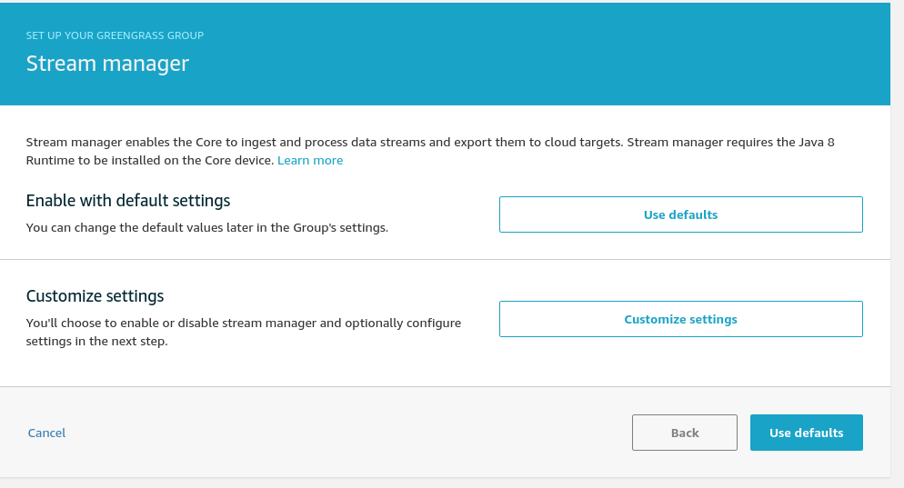

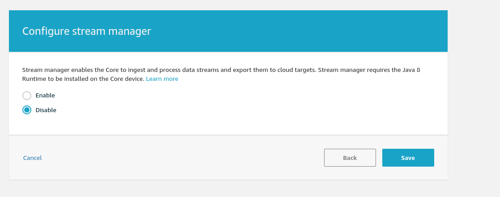

Create new  Greengrass Core:

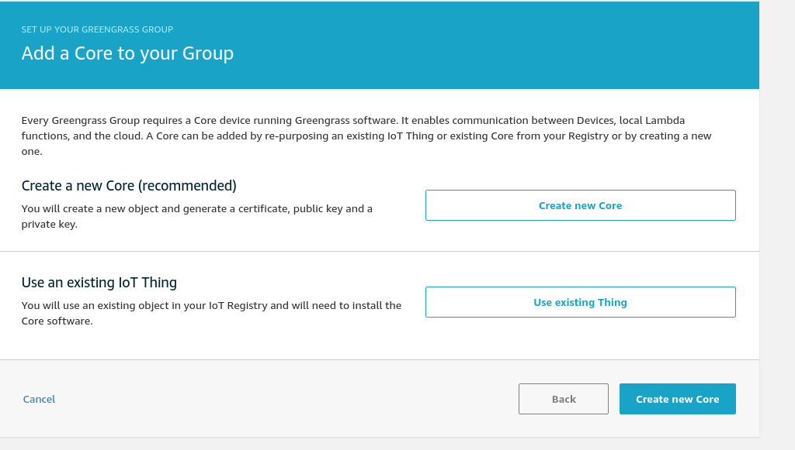

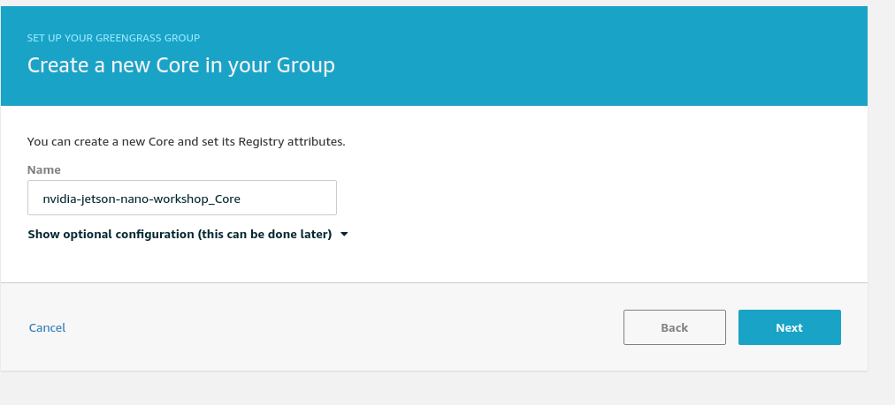

Dowload certs:


After downloading your unique security resource keys to your Jetson that were created in this step, proceed to step below. If you created and downloaded these keys on machine other than Jetson Nano then you will need to copy these to Jetson Nano. You can use SCP to transfer files from your local machine to Jetson Nano.

Download the AWS IoT Greengrass Core Software (1.10.2 or latest) for ARMv8 (aarch64):

(please see latest version here https://docs.aws.amazon.com/greengrass/latest/developerguide/what-is-gg.html#gg-core-download-tab)
```
wget https://d1onfpft10uf5o.cloudfront.net/greengrass-core/downloads/1.10.2/greengrass-linux-aarch64-1.10.2.tar.gz
```

Extract Greengrass core and your unique security keys on your Nano:

```
sudo tar -xzvf greengrass-linux-aarch64-1.10.2.tar.gz -C /
sudo tar -xzvf <hash>-setup.tar.gz -C /greengrass   # these are the security keys downloaded while setting up greengrass
```

Download AWS ATS endpoint root certificate (CA):

```
cd /greengrass/certs/
sudo wget -O root.ca.pem https://www.amazontrust.com/repository/AmazonRootCA1.pem
```
Start greengrass core on your Nano:

```
cd /greengrass/ggc/core/
sudo ./greengrassd start
```

You should get a message in your terminal "Greengrass successfully started with PID: xxx"

#### 2.3 Setup and configure inference code using AWS Lambda
(optional: more info on AWS Greengrass lambda https://docs.aws.amazon.com/greengrass/latest/developerguide/create-lambda.html)

Go to [AWS Management console](https://console.aws.amazon.com/console/home?region=us-east-1) and search for Lambda

Click 'Create function'

Choose 'Author from scratch'

Name the function: e.g. jetson-nano-workshop
Role: Choose an existing role
[Note: You may need to create new role, give basic execution permissions, choose default)

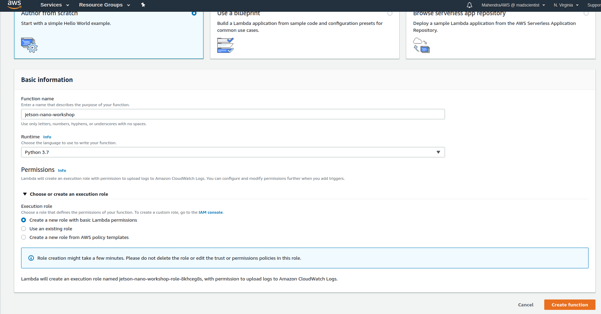

****Please choose Python 3.7 runtime

Click Create Function with default code. Once lambda function is created, open it again and upload  from this repo. You will need to download lambda.zip to your local machine first.


in basic settings, please change the handler to "inference-lambda.lambda_handler"

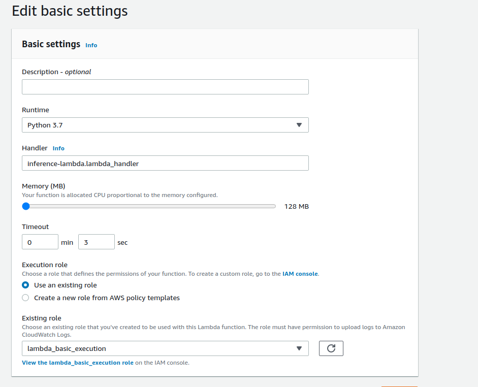


publish lambda


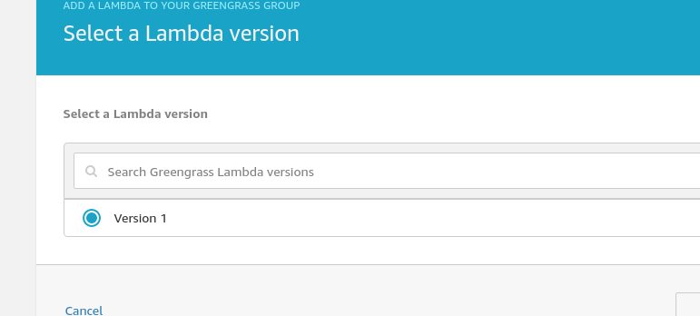

[optional] - You can open the interface-lambda.py a code and get familiar. It uses test.jpg at line#59. This test image will be used by lambda function as input for ML model.

#### 2.4  Set machine leaning at edge deployment
- Go to [AWS Management console](https://console.aws.amazon.com/console/home?region=us-east-1) and search for Greengrass
- Go to AWS IoT Greengrass console
- Choose the greengrass group you created in step 2.2
- Select lambda, choose lambda function you created in 2.3
- Choose default container option
- Make it the lambda long running, more info here ![https://docs.aws.amazon.com/greengrass/latest/developerguide/long-lived.html]
(https://docs.aws.amazon.com/greengrass/latest/developerguide/long-lived.html)

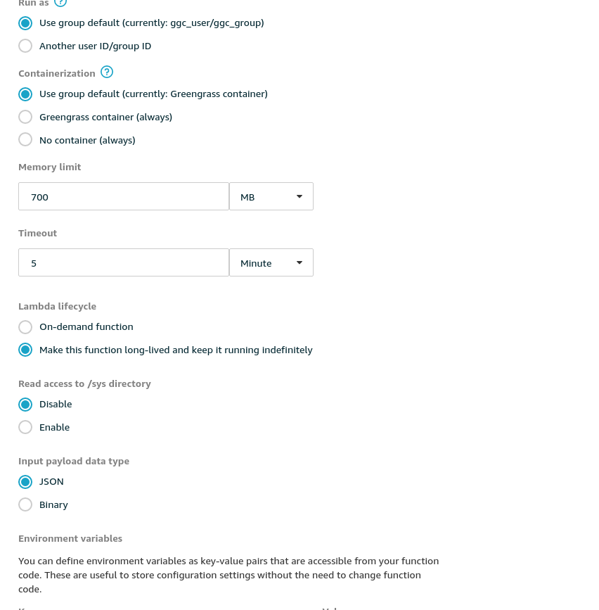

- In memory, set it to 700mb+
- In resources, add ML model as per below, Select S3 bucket where optimized model (i.e. SageMaker Neo compiled) is located. 
***** Select bucket first from dropdown box and then model file *****


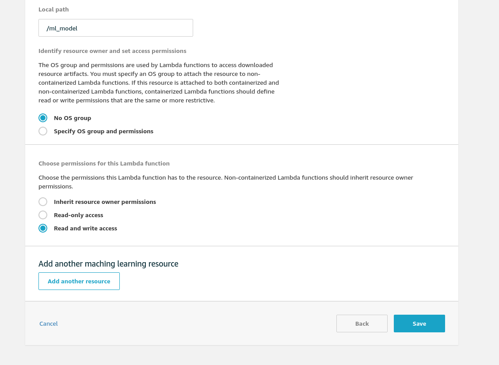

- Setup Greengrass role: go to "Settings" menu on left menu items, this will open Greengrass settings. Check top part that says "Group role", select Greengrass service role. Go to AWS IAM console, go to roles, select the greengrass role and add "AmazonS3fullAccess", "CloudWatchFullAccess" and "AWSGreengrassResourceAccessRolePolicy" .. see screenshot below for reference.


- Setup Greengrass logs
Under "Settings", scroll down, you will see option to setup log level. Setup Greengrass and lambda logs to info-level logs per screenshot below


#### 2.5 Deploy machine learning at edge on NVIDIA Jetson Nano
- make sure Greengras is started

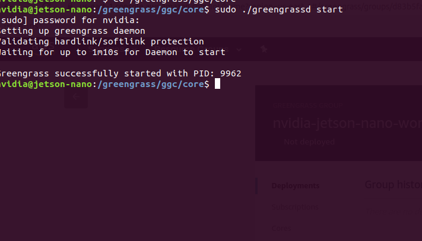

- Go back to AWS IoT Greengrass console
- We will need to send messages from NVIDIA Jetson to cloud. so, we need to setup message subscription per screenshot below.
Choose "subscription" menu from left menu items, choose "source" as your lambda function and destination as "IoT Cloud", topic as one used in the lambda code i.e. "neo-detect". This will route messages from lambda to IoT Cloud i.e. AWS IoT.

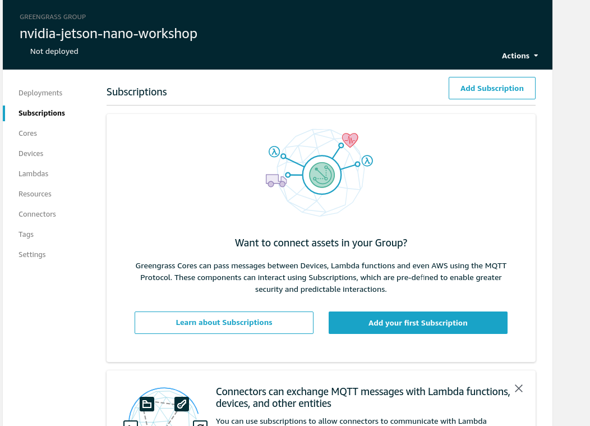

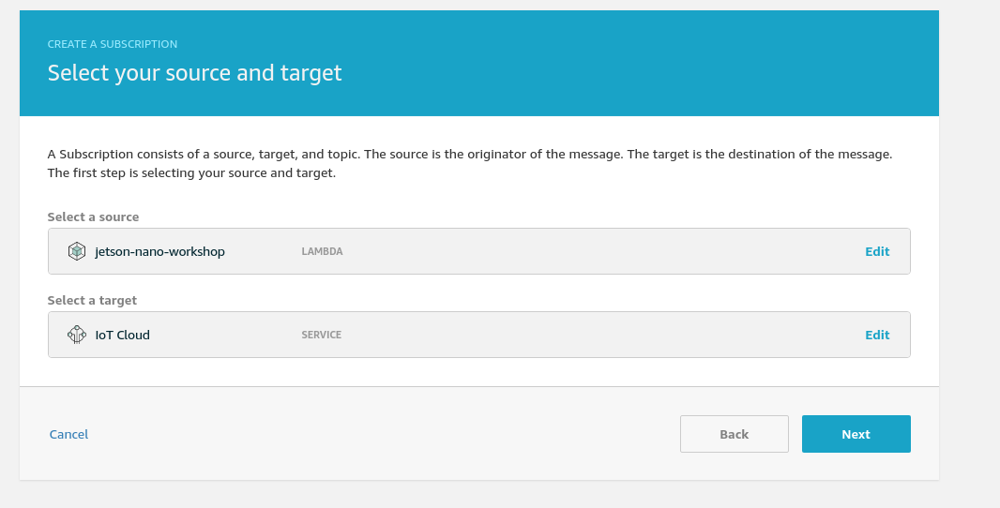

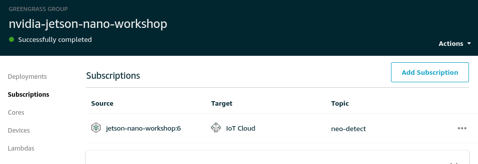

- Now we are ready to deploy model, lambda and configuration.
- From Actions menu on top right side, select "Deploy"
- This will take few minutes to download and deploy model


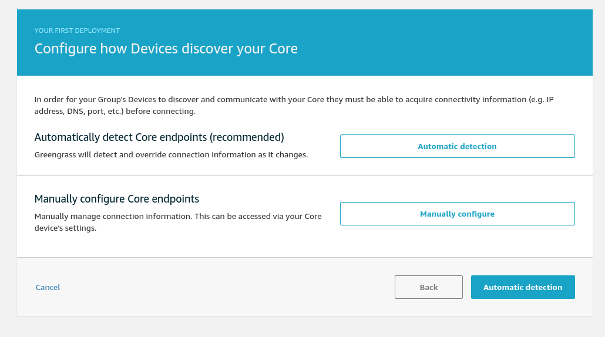


#### 2.6 Check inference
- Go to [AWS Management console](https://console.aws.amazon.com/console/home?region=us-east-1) and search for Greengrass
- Go to AWS IoT console

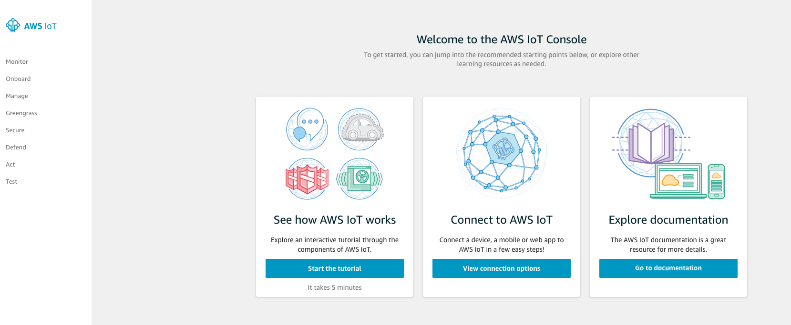

- Select Test from left menu

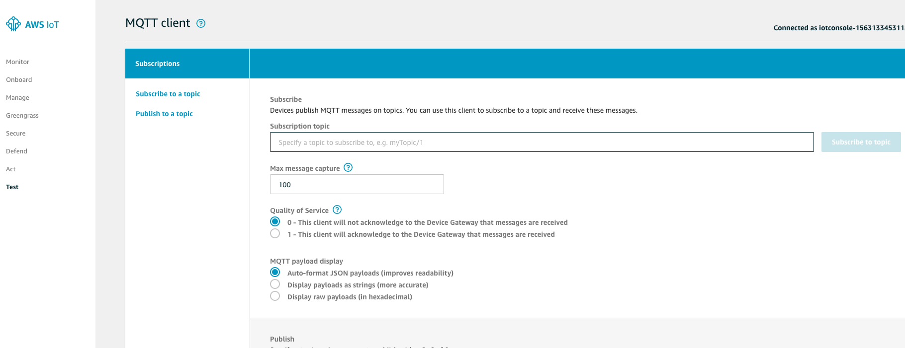

- Add "#" in Subscribe topic, click Subscribe. This will subscribe to all IoT topics coming to Jetson Nano


- In Subscription box you will start seeing IoT messages coming from Jetson nano

#### 2.7 Troubleshooting
- Error logs are recorded in CloudWatch, you can log into AWS CloudWatch and check for greengrass errors
- Lambda user error logs on device are located at /greengrass/ggc/var/log/user and then your region, account number, then you will see log file named after your lambda e.g. inference-lambda.log
- Greengrass system logs are on device at /greengrass/ggc/var/system. There are many logs, runtime log is imp
- if you get any error related to camera buffer then please run command "sudo systemctl restart nvargus-daemon" to restart related process.
- to start and stop greengrass,  cd to /greengrass/ggc/core and then ./greengrassd start to start and ./greengrassd to stop

#### Summary ####

In this lab we have completed:

1.	Setup and configure AWS IoT Greengrass
2.	Deploy the inference lambda function and model on NVIDIA Jetson Nano
3.	Test the model inference data using AWS IoT dashboard
